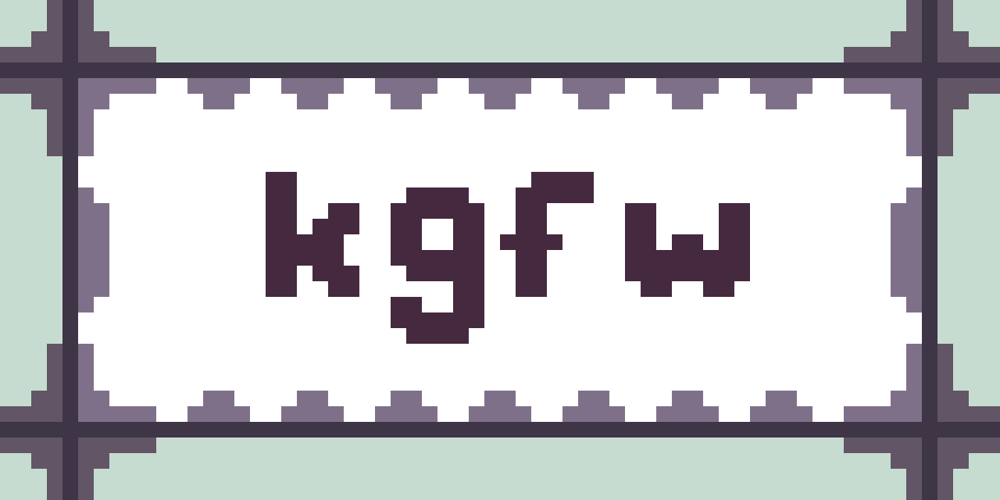

## A simple game framework written solely in C

### Supported Platforms:

|  Symbol  |        Meaning       |
| :------: | :------------------: |
|    X     | `Supported & Tested` |
|    ~     |      `Untested`      |
|          |     `Unsupported`    |
|    ?     |       `Planned`      |

|                |  macOS  |  Linux  |  Windows  |  BSD/UNIX  |  Android  |
| :------------- | :-----: | :-----: | :-------: | :--------: | :-------: |
| D3D11          |         |         |     X     |            |           |
| OpenGL         |    X    |    X    |     X     |     ~      |     ?     |

### Capabilities:

- 3D positional audio via OpenAL
- 3D rendering via OpenGL or D3D11 (API can be chosen at compile-time through macros. See "Build System and Macros")
- Camera system (with support for perspective or orthographic projection)
- Windowing and input via GLFW or WIN32 (GLFW is only used for OpenGL and WIN32 is only used for D3D11)
- Game console and command system (Similar to UNIX-like shells and commands use the C argc, argv interface for arguments)
- Logging system (User-provided string and char logging callbacks)
- kwav Waveform audio loader built-in
- koml parser built-in
- ktga Targa image loader built-in

### Build System and Macros:

kgfw can likely be built with any build system or compiler as long as the dependencies are linked and included properly. Keep in mind, it is possible to compile kgfw as a dynamic, static library, or statically with the game. Also, it can be compiled in a single command with no build system.

#### Tested Compilers:

- MSVC
- Apple Clang
- LLVM Clang
- GNU GCC.

#### Tested Build Systems:

- Visual Studio 2022 via VCProj
- Custom Makefile
- Single compile command

#### Necessary Macros:

##### In order to build, the project needs a graphics API to be selected

- To select D3D11, define KGFW_DIRECTX with the value of 11
- To select OpenGL, define KGFW_OPENGL with the value of 33
